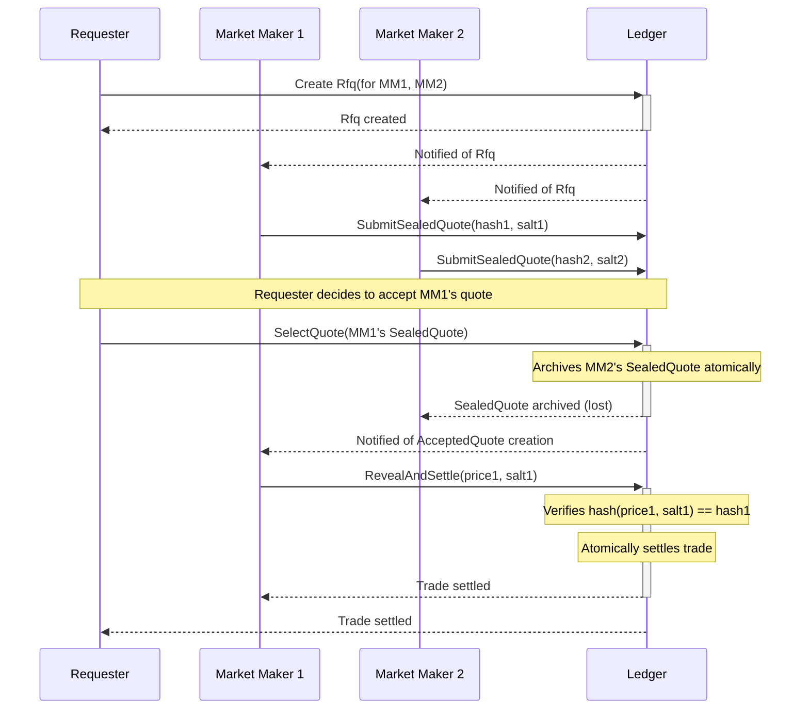

# Canton Sealed-Quote RFQ Protocol

This project provides a Daml implementation of a sealed-quote Request-for-Quote (RFQ) protocol, designed for institutional trading on the Canton Network. It leverages Canton's privacy model to enable Market Makers (MMs) to provide competitive quotes without revealing their pricing information to the requester or other participants if their quote is not selected.

This "Hashflow-style" design ensures that only the winning quote is ever revealed. Losing quotes are atomically destroyed without their contents ever being disclosed, protecting the MMs' proprietary pricing strategies and preventing information leakage.

## Table of Contents

- [Protocol Overview](#protocol-overview)
- [How It Works](#how-it-works)
- [Protocol Flow Diagram](#protocol-flow-diagram)
- [Daml Model](#daml-model)
- [Market Maker Integration Guide](#market-maker-integration-guide)
  - [Step 1: Onboarding](#step-1-onboarding)
  - [Step 2: Listening for RFQs](#step-2-listening-for-rfqs)
  - [Step 3: Calculating and Sealing a Quote](#step-3-calculating-and-sealing-a-quote)
  - [Step 4: Submitting the Sealed Quote](#step-4-submitting-the-sealed-quote)
  - [Step 5: Handling the Outcome](#step-5-handling-the-outcome)
  - [Step 6: Revealing and Settling (If Won)](#step-6-revealing-and-settling-if-won)
- [Development Setup](#development-setup)
- [Project Structure](#project-structure)

## Protocol Overview

In traditional RFQ systems, a requester might see all submitted quotes, even the losing ones. This exposes MMs' pricing and can be used to reverse-engineer their models or trade against them on other venues. This information leakage forces MMs to quote more defensively, resulting in wider spreads and worse execution for the requester.

This protocol solves the problem using cryptographic commitments (hashes) and Canton's atomic transaction capabilities.

**Key Features:**

*   **Privacy by Design:** Losing quotes are never revealed. The contracts representing them are archived from the ledger.
*   **Commitment Scheme:** MMs submit a hash of their quote, committing to a price without revealing it.
*   **Atomic Settlement:** The winning quote is revealed and settled in a single, atomic transaction (e.g., via Delivery-vs-Payment), eliminating settlement risk.
*   **Fairness:** The requester cannot see any prices before selecting a winner, preventing front-running or favoring a specific counterparty based on out-of-band information.

## How It Works

1.  **RFQ Creation:** A `Requester` creates an `Rfq` contract, specifying the asset, quantity, and direction (Buy/Sell). They invite a set of approved `MarketMaker` parties to participate.
2.  **Sealed Quote Submission:** Each invited `MarketMaker` calculates their quote (price). They then generate a unique, secret `salt` (a random string) and compute a cryptographic hash of the price and the salt. They submit this hash to the `Rfq` contract, creating a `SealedQuote`.
3.  **Winner Selection:** The `Requester` reviews the `SealedQuote` submissions (which only contain hashes, not prices). They select one `SealedQuote` to accept. This choice atomically archives all other losing `SealedQuote` contracts.
4.  **Reveal and Settle:** The winning `MarketMaker` is notified that their quote was accepted. They then exercise a choice to reveal the original price and the secret salt. The contract logic re-computes the hash and verifies it matches their original submission. If it matches, the trade is considered executed, and a settlement instruction (e.g., DVP) can be triggered.

## Protocol Flow Diagram



## Daml Model

The core of the protocol is defined in a few key Daml templates:

*   `MarketMakerRole`: A bilateral agreement between a `Requester` and a `MarketMaker`, signifying an approved relationship. This is used to control who can be invited to an RFQ.
*   `Rfq`: The initial request contract created by the `Requester`. It contains the trade parameters and the list of invited MMs.
*   `SealedQuote`: Represents a MM's hashed, confidential quote. It's a commitment that the MM will honor the price if chosen.
*   `AcceptedQuote`: Created when the `Requester` selects a winner. This contract holds the winning hash and awaits the MM's reveal.
*   `SettledTrade`: The final contract, created upon successful reveal and settlement, serving as a record of the completed trade.

## Market Maker Integration Guide

This guide outlines the steps for a Market Maker to integrate their automated trading systems with this RFQ protocol.

### Prerequisites

*   A party ID on the Canton network where the protocol is deployed.
*   An application with JWT-based access to a Participant Node's JSON API.
*   Familiarity with the Canton JSON API for querying the ledger and submitting commands.

### Step 1: Onboarding

Before you can participate in RFQs, the requester must grant you a `MarketMakerRole` contract. This is typically done after a legal/business onboarding process. Once created, this contract will appear in your Active Contract Set (ACS) and serves as your key to receive RFQ invitations from that specific requester.

### Step 2: Listening for RFQs

Your application should monitor the ledger for new `Rfq` contracts where you are an observer. You can do this by streaming queries against the `Rfq` template ID.

**Using the JSON API `/v2/state/active-contracts` (stream):**

Your application can establish a persistent connection to this endpoint to receive real-time notifications of new RFQs. Filter for the `Rfq` template ID.

### Step 3: Calculating and Sealing a Quote

When you receive an `Rfq`, your pricing engine will calculate a price for the specified instrument and quantity. To seal it:

1.  **Generate a Salt:** Create a cryptographically secure random string. This salt must be unique for each quote to prevent replay attacks and ensure hash uniqueness. A UUID is a good choice.
2.  **Prepare the Payload:** Concatenate the price (as a string, to a fixed precision) and the salt. For example: `101.2345my-secret-salt-uuid`.
3.  **Compute the Hash:** Use the SHA-256 algorithm on the concatenated string. The result is your `quoteHash`.

**Example (pseudocode):**

```
price = "101.2345000000" // Daml Decimal format
salt = generate_uuid_v4()
payload_to_hash = price + salt
quote_hash = sha256(payload_to_hash)
```

**Important:** You must securely store the `price` and `salt` locally, as you will need them later if your quote is accepted.

### Step 4: Submitting the Sealed Quote

Find the contract ID (`cid`) of the `Rfq` you are responding to. Exercise the `SubmitSealedQuote` choice on that contract.

**JSON API `/v1/exercise` Request:**

```json
{
  "templateId": "RfqProtocol.Rfq:Rfq",
  "contractId": "<rfq_contract_id>",
  "choice": "SubmitSealedQuote",
  "argument": {
    "quoteHash": "<your_sha256_hash>"
  }
}
```

This will create a `SealedQuote` contract on the ledger, visible to you and the requester.

### Step 5: Handling the Outcome

After submitting, monitor the ledger for two possible outcomes:

1.  **You Won:** An `AcceptedQuote` contract is created where you are the signatory. Your application should be streaming queries for this template. The appearance of this contract is the signal to proceed to the final step.
2.  **You Lost:** Your `SealedQuote` contract will be archived from the ledger. A query for its contract ID will return nothing, or you will receive an "archive" event from the stream. No further action is needed. Your price and salt remain secret.

### Step 6: Revealing and Settling (If Won)

If you receive an `AcceptedQuote` contract, you must reveal your quote to settle the trade.

1.  **Retrieve Quote Data:** Look up the `price` and `salt` you stored locally, associated with this RFQ.
2.  **Exercise RevealAndSettle:** Find the contract ID of the `AcceptedQuote` and exercise the `RevealAndSettle` choice.

**JSON API `/v1/exercise` Request:**

```json
{
  "templateId": "RfqProtocol.Rfq:AcceptedQuote",
  "contractId": "<accepted_quote_contract_id>",
  "choice": "RevealAndSettle",
  "argument": {
    "price": "101.2345000000",
    "salt": "<your_secret_salt_uuid>"
  }
}
```

The ledger will validate your submission. If the hash of the provided `price` and `salt` matches the one in the `AcceptedQuote`, the contract will be consumed and a `SettledTrade` will be created, finalizing the transaction.

## Development Setup

To build and test this project locally:

1.  **Install DPM:**
    ```bash
    curl https://get.digitalasset.com/install/install.sh | sh
    ```

2.  **Clone the repository:**
    ```bash
    git clone <repo_url>
    cd canton-rfq-protocol
    ```

3.  **Build the Daml model:**
    ```bash
    dpm build
    ```
    This compiles the Daml code into a DAR file located in `.daml/dist/`.

4.  **Run the local Canton sandbox:**
    ```bash
    dpm sandbox
    ```
    This starts a local ledger environment. The JSON API will be available at `http://localhost:7575`.

5.  **Run tests:**
    ```bash
    dpm test
    ```

## Project Structure

```
.
├── daml/
│   └── RfqProtocol/
│       └── Rfq.daml       # Main Daml templates for the protocol
├── daml.yaml              # Daml project configuration
├── .gitignore
└── README.md              # This file
```